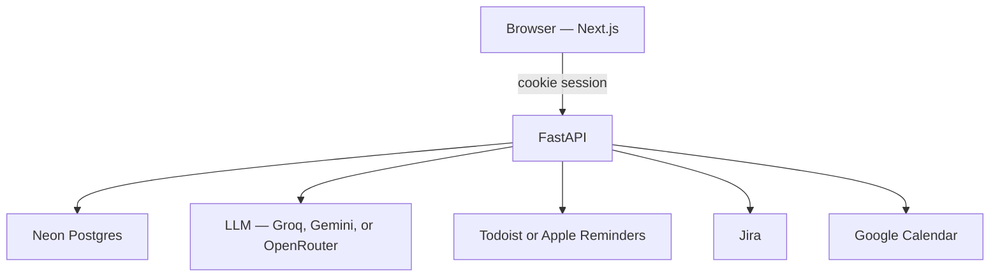

# Guide Todoo

Personal AI task planner. You sign in, tell it how your day actually works, and it turns PDFs, chat, and optional Jira issues into a short daily plan. Tasks sync to Todoist (or Apple Reminders). Morning, evening, weekly, and monthly jobs score what you finished and roll the rest forward.

Each account is isolated. Tasks, profile, memories, and reports belong to the signed-in user.

## System flow



1. **Account.** Sign up at `/signup`, then sign in at `/login`. The API stores the user in Postgres and sets an `httponly` session cookie. Creating an account does not sign you in.
2. **Onboarding.** Role, work hours, deep-work window, side goals, notification style, and a main goal are saved on the profile. That profile becomes the first memories the planner uses.
3. **Ingest.** A PDF, a chat message, or a Jira sync is read together with the profile and saved memories. The model breaks the work into small tasks that fit free time, and it respects the daily task cap.
4. **Schedule.** Hard work is placed in the deep-work window. Job hours stay blocked. Only a few tasks are due each day.
5. **Notify.** New tasks are pushed to Todoist (recommended) or Apple Reminders. Completing a task in Todoist can call back through a webhook and mark it done here.
6. **Review.** Morning brief, end-of-day score, weekly report, and monthly report run per user. Incomplete work moves to the next free slot, and the model stores one or two new memories from the day.

On a laptop, Next.js rewrites API paths to `http://127.0.0.1:8787`. On Vercel, the same FastAPI app is served from `api/index.py`, and Vercel Cron calls the scheduled jobs.

## Tech stack

| Layer | Choice |
| --- | --- |
| Web UI | Next.js 15, React 19, TypeScript, Tailwind CSS 4 |
| API | FastAPI, Uvicorn, Pydantic Settings |
| Database | Neon Postgres via `psycopg` |
| Auth | Email and password, scrypt hashes, HMAC-signed `gt_session` cookie |
| LLM | OpenAI-compatible client. Groq by default; Gemini or OpenRouter also work |
| Tasks | Todoist REST, or Apple Reminders through AppleScript / a Mac bridge |
| Calendar | Google Calendar OAuth (optional) |
| Jobs | APScheduler locally; Vercel Cron in production |
| Issue import | Jira REST (optional) |

## App routes

| Path | What it is |
| --- | --- |
| `/signup` | Create an account |
| `/login` | Sign in |
| `/` | Today’s plan and tasks |
| `/onboarding` | Profile and schedule preferences |
| `/progress` | Scores, streaks, LeetCode log |
| `/settings` | Profile, calendar, notification settings |

## API

Interactive docs: `http://127.0.0.1:8787/docs`

| Method | Path | Purpose |
| --- | --- | --- |
| POST | `/auth/register` | Create an account |
| POST | `/auth/login` | Start a session |
| POST | `/auth/logout` | Clear the session |
| GET | `/auth/me` | Current user |
| POST | `/onboard` | Save profile and starting memories |
| POST | `/ingest/pdf` | PDF to tasks |
| POST | `/ingest/chat` | Chat message to tasks |
| POST | `/jira/sync` | Pull assigned Jira issues |
| POST | `/plan/daily` | Build today’s plan |
| GET | `/tasks` | List this user’s tasks |
| POST | `/tasks/complete` | Mark a task done |
| GET | `/review/daily` | End-of-day score |
| GET | `/review/weekly` | Weekly report |
| POST | `/review/monthly` | Monthly report |
| GET | `/brief/morning` | Morning brief |
| POST | `/sync/todoist` | Push and pull Todoist |
| GET | `/auth/google` | Connect Google Calendar |

Cron paths (`/api/cron/morning`, `/eod`, `/weekly`, `/monthly`, `/sync-todoist`) run the same jobs for every user. They expect `CRON_SECRET`.

## Data

Tables are created on the first API call.

| Table | Holds |
| --- | --- |
| `users` | Email, name, password hash |
| `user_profiles` | Hours, goals, notification style |
| `user_memories` | Preferences and what the planner learned |
| `tasks` | Planned work, status, reminder id |
| `daily_plans` | One plan per user per day |
| `weekly_reports` / `monthly_reports` | Review snapshots |
| `leetcode_solves` | Optional practice log |
| `oauth_tokens` | Google Calendar tokens |

## Run locally

Requirements: Python 3.11+, Node.js 20+, a Neon database, and an LLM API key.

```bash
python3.12 -m venv .venv
source .venv/bin/activate
pip install -e .

cp .env.example .env
# Set DATABASE_URL, LLM_API_KEY, and a long random SESSION_SECRET

uvicorn guide_todoo.api:app --reload --host 127.0.0.1 --port 8787
```

In a second terminal:

```bash
npm install
npm run dev
```

Open `http://localhost:3000`. Sign up, then sign in.

CLI, once the API dependencies are installed:

```bash
guide-todoo chat "Finish the API docs by Friday"
guide-todoo plan
guide-todoo summary
```

Pass `--user you@email.com` when more than one account exists.

## Environment

Copy `.env.example`. Required:

| Variable | Why |
| --- | --- |
| `DATABASE_URL` | Neon connection string, with `sslmode=require` |
| `LLM_API_KEY` | Groq, Gemini, or OpenRouter key |
| `SESSION_SECRET` | Signs the login cookie. Use a long random string |

Optional: `LLM_PROVIDER`, `LLM_MODEL`, Todoist (`TASKS_BACKEND`, `TODOIST_API_TOKEN`), Jira, Google Calendar, `CRON_SECRET`, and `TODOIST_WEBHOOK_SECRET`.

Do not commit `.env`.

## Deploy

Vercel builds the Next.js app and the Python API together (`vercel.json`). Set the same environment variables in the Vercel project. Cron schedules are in UTC.

Apple Reminders cannot run on Vercel. Use Todoist, or run `guide-todoo bridge` on a Mac so cloud tasks land in iCloud Reminders. See `docs/VERCEL_AND_REMINDERS.md`.

## Layout

```
src/app/                 Next.js pages
src/components/          UI
src/lib/api.ts           Browser API client
src/guide_todoo/         FastAPI app, planner, auth, scheduler
src/guide_todoo/integrations/   Todoist, Reminders, Jira, Google Calendar
api/index.py             Vercel entry for the Python API
docs/                    Longer design notes
```

## License

MIT
